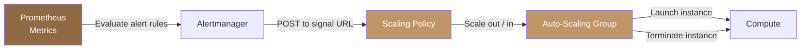

## Overview

Polystack Orchestration provides native auto-scaling through three coordinated resource types: a
<Tooltip tip="A managed group of identical instances that can scale in or out as a unit.">scaling group</Tooltip>,
a scaling policy, and an alarm trigger. When a metric threshold is breached — such as CPU
utilization exceeding 80% — the alarm fires a webhook that activates the scaling policy, which
adds or removes instances from the group.

Prometheus is the monitoring backend for alarm-driven scaling. It replaces legacy telemetry
stacks (Ceilometer/Aodh) and provides a more reliable, standards-based metrics pipeline with
support for multi-dimensional labels, alerting rules, and long-retention storage.

<Note>
  **Prerequisites**
  - Polystack Orchestration enabled in your project
  - A compatible image and flavor for scaled instances
  - Prometheus deployed and scraping compute metrics ([see Prometheus integration](/integrations/prometheus))
  - Basic familiarity with [orchestration templates](/services/orchestration/template-guide)
</Note>

---

## Architecture



### Scaling Components

| Component | Resource Type | Purpose |
|-----------|--------------|---------|
| **Auto-Scaling Group** | `OS::Heat::AutoScalingGroup` | Manages a pool of identical instances with min/max size constraints |
| **Scaling Policy** | `OS::Heat::ScalingPolicy` | Defines how to adjust the group — add N, remove N, or set exact size |
| **Signal URL** | Produced by `ScalingPolicy` | Webhook endpoint activated by Prometheus Alertmanager or manual POST |
| **Prometheus** | External | Scrapes instance metrics, evaluates alert rules, fires webhooks |

---

## Use Cases

| Use Case | Description | Trigger |
|----------|-------------|---------|
| **Elastic web / application tier** | Scale web server instances based on HTTP request rate or CPU utilization | Prometheus alert |
| **CI/CD build farm** | Add worker nodes during active builds, shrink on idle | Schedule or webhook |
| **Batch processing cluster** | Provision compute nodes for heavy batch jobs, release when complete | Manual or scheduled |
| **Dev/test resource pools** | Automatically scale out environments for short-lived test runs | On-demand webhook |
| **Disaster recovery warm pool** | Maintain standby instances that scale out during failover events | Alertmanager webhook |

---

## Orchestration Templates

### Static Cluster Template

Use this template when you need a fixed number of instances deployed as a named group. Each
instance is declared as a discrete resource — suitable for small, stable clusters.

```yaml title="static-cluster.yaml"
heat_template_version: 2016-10-14

description: Static 3-node compute cluster

parameters:
  image:
    type: string
    default: Ubuntu-22.04
  flavor:
    type: string
    default: m1.small
  network:
    type: string
    default: private
  key_name:
    type: string

resources:
  vm1:
    type: OS::Nova::Server
    properties:
      name: cluster-node-1
      image: { get_param: image }
      flavor: { get_param: flavor }
      key_name: { get_param: key_name }
      networks:
        - network: { get_param: network }

  vm2:
    type: OS::Nova::Server
    properties:
      name: cluster-node-2
      image: { get_param: image }
      flavor: { get_param: flavor }
      key_name: { get_param: key_name }
      networks:
        - network: { get_param: network }

  vm3:
    type: OS::Nova::Server
    properties:
      name: cluster-node-3
      image: { get_param: image }
      flavor: { get_param: flavor }
      key_name: { get_param: key_name }
      networks:
        - network: { get_param: network }

outputs:
  vm1_ip:
    value: { get_attr: [vm1, first_address] }
  vm2_ip:
    value: { get_attr: [vm2, first_address] }
  vm3_ip:
    value: { get_attr: [vm3, first_address] }
```

### Auto-Scaling Template

This template creates a web tier that scales between 1 and 10 instances. The scaling policy
signal URLs are exposed as stack outputs and can be wired into Prometheus Alertmanager webhook
receivers.

```yaml title="autoscaling-stack.yaml"
heat_template_version: 2016-10-14

description: >
  Auto-scaling web tier with scale-out and scale-in policies.
  Signal URLs are consumed by Prometheus Alertmanager webhook receivers.

parameters:
  image:
    type: string
    label: Instance Image

  flavor:
    type: string
    label: Instance Flavor
    default: m1.small

  key_name:
    type: string
    label: Key Pair

  network:
    type: string
    label: Network

  min_size:
    type: number
    default: 1
    constraints:
      - range: { min: 1, max: 10 }

  max_size:
    type: number
    default: 10
    constraints:
      - range: { min: 2, max: 20 }

resources:

  # Auto-scaling group — manages the instance pool
  web_asg:
    type: OS::Heat::AutoScalingGroup
    properties:
      min_size: { get_param: min_size }
      max_size: { get_param: max_size }
      desired_capacity: { get_param: min_size }
      resource:
        type: OS::Nova::Server
        properties:
          image: { get_param: image }
          flavor: { get_param: flavor }
          key_name: { get_param: key_name }
          networks:
            - network: { get_param: network }
          user_data: |
            #!/bin/bash
            apt-get update -y
            apt-get install -y nginx
            systemctl enable --now nginx

  # Scale-out policy — add 1 instance per trigger
  scale_out_policy:
    type: OS::Heat::ScalingPolicy
    properties:
      auto_scaling_group_id: { get_resource: web_asg }
      adjustment_type: change_in_capacity
      scaling_adjustment: 1
      cooldown: 60

  # Scale-in policy — remove 1 instance per trigger
  scale_in_policy:
    type: OS::Heat::ScalingPolicy
    properties:
      auto_scaling_group_id: { get_resource: web_asg }
      adjustment_type: change_in_capacity
      scaling_adjustment: -1
      cooldown: 120

outputs:
  scale_out_url:
    description: Webhook URL to trigger scale-out (wire into Alertmanager)
    value: { get_attr: [scale_out_policy, signal_url] }

  scale_in_url:
    description: Webhook URL to trigger scale-in (wire into Alertmanager)
    value: { get_attr: [scale_in_policy, signal_url] }

  current_size:
    description: Current instance count in the scaling group
    value: { get_attr: [web_asg, current_size] }
```

---

## Adjustment Types

| `adjustment_type` | Behavior | Example |
|-------------------|----------|---------|
| `change_in_capacity` | Add or remove N instances relative to current count | `scaling_adjustment: 2` adds 2 instances |
| `exact_capacity` | Set the group to exactly N instances | `scaling_adjustment: 5` sets group size to 5 |
| `percent_change_in_capacity` | Change capacity by a percentage of current size | `scaling_adjustment: 25` adds 25% more instances |

---

## Prometheus Integration

Prometheus Alertmanager delivers scaling signals by sending an HTTP POST to the policy signal
URL. Configure a webhook receiver in your Alertmanager configuration:

```yaml title="alertmanager.yml"
route:
  receiver: "default"
  routes:
    - match:
        alertname: "HighCpuUsage"
      receiver: "scale-out"
    - match:
        alertname: "LowCpuUsage"
      receiver: "scale-in"

receivers:
  - name: "scale-out"
    webhook_configs:
      - url: "<scale_out_url from stack output>"
        send_resolved: false

  - name: "scale-in"
    webhook_configs:
      - url: "<scale_in_url from stack output>"
        send_resolved: false
```

A matching Prometheus alert rule that fires when average CPU exceeds 80% for 2 minutes:

```yaml title="alert-rules.yml"
groups:
  - name: autoscaling
    rules:
      - alert: HighCpuUsage
        expr: avg(rate(node_cpu_seconds_total{mode!="idle"}[2m])) by (job) > 0.80
        for: 2m
        labels:
          severity: warning
        annotations:
          summary: "CPU usage above 80% — triggering scale-out"

      - alert: LowCpuUsage
        expr: avg(rate(node_cpu_seconds_total{mode!="idle"}[10m])) by (job) < 0.20
        for: 10m
        labels:
          severity: info
        annotations:
          summary: "CPU usage below 20% — triggering scale-in"
```

<Tip>
  Use longer evaluation windows (5–10 minutes) for scale-in rules to avoid prematurely
  terminating instances during short idle periods. Scale-out rules can use shorter windows
  (1–2 minutes) to respond faster to load spikes.
</Tip>

---

## Deploy and Trigger Scaling

<Tabs>
  <Tab title="Dashboard" icon="gauge">
    <Steps titleSize="h3">
      <Step title="Deploy the auto-scaling stack" icon="rocket">
        Navigate to **Orchestration > Stacks** and click **Create Stack**.

        In the **Prepare Template** step, upload `autoscaling-stack.yaml`. In the
        **Orchestration Information** step, fill in the parameters:

        | Parameter | Example Value | Description |
        |-----------|--------------|-------------|
        | `image` | `Ubuntu-22.04` | Base image for scaled instances |
        | `flavor` | `m1.small` | Instance size |
        | `key_name` | `my-keypair` | SSH key pair for access |
        | `network` | `private` | Network for instances |
        | `min_size` | `1` | Minimum instance count |
        | `max_size` | `10` | Maximum instance count |

        Click **Confirm**.

        <Check>Stack reaches **Create Complete**. The scaling group shows the initial instance count.</Check>
      </Step>
      <Step title="Retrieve webhook URLs" icon="link">
        Open the stack detail page and select the **Detail** tab (Outputs card). Copy the values for
        `scale_out_url` and `scale_in_url` — these are used as Alertmanager webhook
        receiver URLs.
      </Step>
      <Step title="Manually trigger scale-out" icon="trending-up">
        To test scaling without waiting for an alert, send an HTTP POST to the signal URL:

        ```bash title="Trigger scale-out via webhook"
        curl -X POST "<scale_out_url>"
        ```

        <Check>The scaling group adds one instance. Check the **Stack Resources** tab to confirm the new member.</Check>
      </Step>
      <Step title="Monitor the group" icon="activity">
        Return to **Orchestration > Stacks** and open the stack. The **Stack Resources**
        tab shows the current group resources. The **Stack Events** tab shows scaling
        events in real time as Prometheus alerts fire and Alertmanager posts to the signal URLs.
      </Step>
    </Steps>
  </Tab>
  <Tab title="CLI" icon="terminal">
    <Steps titleSize="h3">
      <Step title="Authenticate" icon="key">
        ```bash title="Load credentials"
        source openrc.sh
        ```
      </Step>
      <Step title="Deploy the stack" icon="rocket">
        ```bash title="Create the auto-scaling stack"
        openstack stack create \
          --template autoscaling-stack.yaml \
          --parameter image=Ubuntu-22.04 \
          --parameter key_name=my-keypair \
          --parameter network=private \
          --parameter min_size=1 \
          --parameter max_size=10 \
          --wait \
          web-asg-stack
        ```
      </Step>
      <Step title="Retrieve webhook URLs" icon="link">
        ```bash title="Get scaling webhook URLs"
        openstack stack output show web-asg-stack scale_out_url -c output_value -f value
        openstack stack output show web-asg-stack scale_in_url -c output_value -f value
        ```

        Store these URLs in your Alertmanager webhook receiver configuration.
      </Step>
      <Step title="Trigger scale-out manually" icon="trending-up">
        ```bash title="Signal scale-out"
        SCALE_OUT_URL=$(openstack stack output show web-asg-stack scale_out_url \
          -c output_value -f value)
        curl -X POST "$SCALE_OUT_URL"
        ```

        ```bash title="Verify group size increased"
        openstack stack resource list web-asg-stack
        ```

        <Check>The auto-scaling group shows one additional member instance.</Check>
      </Step>
      <Step title="Check current group size" icon="bar-chart">
        ```bash title="Show current instance count"
        openstack stack output show web-asg-stack current_size -c output_value -f value
        ```
      </Step>
    </Steps>
  </Tab>
</Tabs>

---

## Cooldown Periods

Cooldown prevents rapid successive scaling events from destabilizing your workload. The
`cooldown` value is specified in seconds per scaling policy.

| Scenario | Recommended Scale-Out Cooldown | Recommended Scale-In Cooldown |
|----------|-------------------------------|-------------------------------|
| Fast-booting instances (cloud image, no init) | 30–60 s | 60–90 s |
| Instances with cloud-init provisioning | 90–120 s | 120–180 s |
| Instances requiring application warm-up | 120–180 s | 180–300 s |

<Warning>
  Setting cooldown too low on scale-in can cause thrashing — where instances are terminated
  before the remaining group has stabilized under the new load distribution. Use a scale-in
  cooldown at least twice the scale-out cooldown.
</Warning>

---

## Troubleshooting

<AccordionGroup>
  <Accordion title="Stack fails to create with CREATE_FAILED" icon="circle-x">
    **Cause**: Insufficient quota, unavailable flavor, or invalid image name.

    **Resolution**:
    ```bash title="Check stack events for the error message"
    openstack stack event list web-asg-stack --nested-depth 5
    ```
    Review the `resource_status_reason` field. Common causes:
    - Compute quota exceeded — check with `openstack quota show`
    - Image not found — verify with `openstack image list`
    - Flavor not available in the target availability zone
  </Accordion>

  <Accordion title="Scale-out webhook returns 401 or 403" icon="lock">
    **Cause**: The signal URL contains a temporary token that has expired, or the URL was
    copied incorrectly.

    **Resolution**: Retrieve a fresh signal URL from the stack output:
    ```bash title="Refresh signal URL"
    openstack stack output show web-asg-stack scale_out_url -c output_value -f value
    ```
    Signal URLs are valid as long as the stack exists. Update your Alertmanager config with
    the current URL after any stack update.
  </Accordion>

  <Accordion title="Auto-scaling group does not grow beyond min_size" icon="trending-up">
    **Cause**: Alertmanager is not reaching the signal URL, or the Prometheus alert is not
    firing.

    **Resolution**:
    1. Verify Alertmanager is running: `curl http://<alertmanager-host>:9093/-/healthy`
    2. Check alert state in Prometheus UI under **Alerts**
    3. Confirm the webhook receiver URL in Alertmanager config matches the stack output
    4. Test manually: `curl -X POST "<scale_out_url>"` — if this works, the stack is healthy
  </Accordion>

  <Accordion title="Instances in the group show BUILD or ERROR" icon="clock">
    **Cause**: Compute capacity exhausted on available hosts, or image boot failure.

    **Resolution**:
    ```bash title="List instances in the scaling group"
    openstack stack resource list web-asg-stack --nested-depth 2
    ```
    Identify failed instances and check their events:
    ```bash title="Check instance events"
    openstack server event list <instance-id>
    ```
  </Accordion>
</AccordionGroup>

---

## Next Steps

<CardGroup cols={2}>
  <Card title="Template Guide" href="/services/orchestration/template-guide" color="#bf9667">
    Learn intrinsic functions and conditions used in scaling templates
  </Card>
  <Card title="Manage Stacks" href="/services/orchestration/stacks" color="#bf9667">
    Update, suspend, and manage the auto-scaling stack lifecycle
  </Card>
  <Card title="Prometheus Integration" href="/integrations/prometheus" color="#bf9667">
    Configure Prometheus scrape targets and alert rules for scaling triggers
  </Card>
  <Card title="Polystack Load Balancer" href="/services/load-balancer" color="#bf9667">
    Front auto-scaling groups with a load balancer for traffic distribution
  </Card>
</CardGroup>
