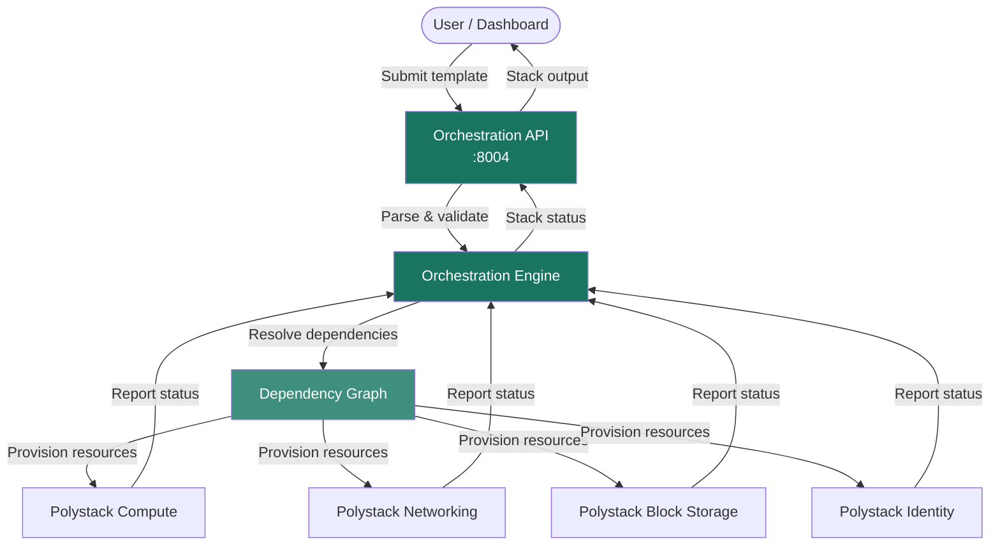

Define and deploy cloud infrastructure as code using declarative templates.
Polystack Orchestration enables repeatable, version-controlled provisioning of entire
application stacks — compute, networking, storage, and scaling policies — from a
single template file.

<Card title="Ironcore — Advanced Virtualization Solutions" icon="external-link" href="https://polystack.tech/ironcore" color="#197560" horizontal>
  Product details on polystack.tech
</Card>

---

Orchestration

<CardGroup cols={4}>
  <Card title="User Guide" icon="book-open" href="/services/orchestration/user-guide" color="#197560">
    Create stacks, manage resources, configure auto-scaling, and work with
    orchestration templates for your infrastructure.
  </Card>
  <Card title="Admin Guide" icon="shield-check" href="/services/orchestration/admin-guide" color="#197560">
    Configure the Orchestration service, manage the stack domain, tune
    performance, and secure template-based deployments.
  </Card>
  <Card title="Template Guide" icon="file-code" href="/services/orchestration/template-guide" color="#197560">
    Deep reference for template structure, parameter types, resource
    definitions, intrinsic functions, and conditions.
  </Card>
  <Card title="CLI Reference" icon="terminal" href="/services/orchestration/cli-reference" color="#197560">
    Command-line operations for stack create, update, list, show, delete,
    and template validation.
  </Card>
</CardGroup>

---

Key Capabilities

<CardGroup cols={3}>
  <Card title="Template-Based Deployment" icon="file-code" href="/services/orchestration/template-guide" color="#197560">
    Describe your entire infrastructure in a single declarative template.
    Provision networks, instances, volumes, and policies with one API call.
  </Card>
  <Card title="Auto-Scaling" icon="trending-up" href="/services/orchestration/autoscaling" color="#197560">
    Define scaling groups and alarm-driven policies to automatically grow or
    shrink instance pools in response to real-time demand.
  </Card>
  <Card title="Stack Composition" icon="layers" href="/services/orchestration/stacks" color="#197560">
    Compose large deployments from smaller, reusable nested stacks. Share
    templates across projects and environments.
  </Card>
  <Card title="Resource Management" icon="boxes" href="/services/orchestration/resources" color="#197560">
    Manage the full lifecycle of every resource in a stack as a unit — create,
    update, rollback, suspend, resume, and delete together.
  </Card>
  <Card title="High Availability Support" icon="heart-pulse" href="/services/instance-ha/index" color="#197560">
    Model multi-zone, load-balanced, and auto-recovering application topologies
    directly in your orchestration templates.
  </Card>
  <Card title="Plugin Extensibility" icon="puzzle" href="/services/orchestration/configuration" color="#197560">
    Over 100 built-in resource types covering compute, networking, storage,
    identity, and orchestration primitives. Custom plugins supported.
  </Card>
</CardGroup>

---

How It Works

---

Related Services

<CardGroup cols={4}>
  <Card title="Polystack Compute" icon="server" href="/services/compute" color="#197560">
    Virtual machine instances provisioned and managed by orchestration stacks
  </Card>
  <Card title="Polystack Block Storage" icon="hard-drive" href="/services/storage/index" color="#197560">
    Persistent volumes created and attached through orchestration templates
  </Card>
  <Card title="Polystack Networking" icon="network" href="/services/networking/index" color="#197560">
    Networks, subnets, routers, and floating IPs defined in stack templates
  </Card>
  <Card title="Polystack Load Balancer" icon="combine" href="/services/load-balancer" color="#197560">
    Load balancer resources for auto-scaling groups in orchestration stacks
  </Card>
</CardGroup>
