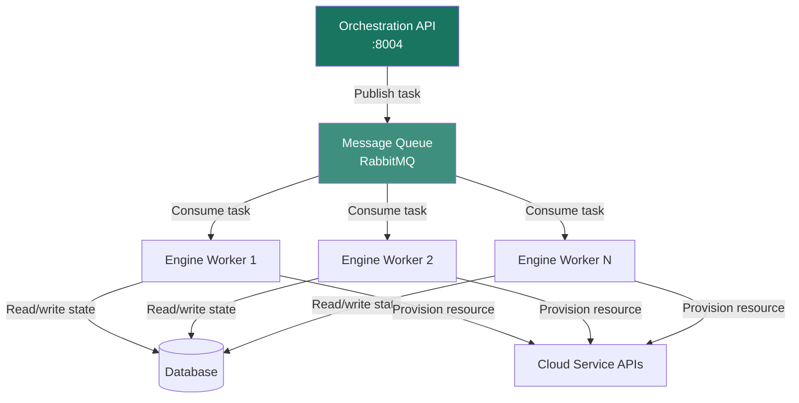

import AdminWarning from '/snippets/admin-warning.mdx';

## Overview

The Orchestration engine is a horizontally scalable service. Multiple engine worker
processes can run on a single controller node or across multiple controller nodes,
sharing work through a message queue. In convergence mode, the engine distributes
individual resource operations across all available workers, enabling parallel
provisioning of independent resources within a single stack.

<AdminWarning />

---

## Engine Worker Architecture



---

## Worker Configuration

### Engine Workers Per Node

The `heat_engine_workers` setting controls how many engine worker processes run on
each controller node. Each worker is an independent process that picks up tasks from
the message queue.

<Tabs>
  <Tab title="XDeploy" icon="gauge">
    In XDeploy, navigate to **Configuration → Services → Orchestration** and adjust
    the **Engine Workers** slider. A common starting point is 2–4 workers per CPU core
    available on the controller node.
  </Tab>
  <Tab title="CLI" icon="terminal">
    ```bash title="Set engine workers in globals"
    # Edit /etc/xavs/globals.d/_50_orchestration.yml
    heat_engine_workers: 8      # Adjust based on controller CPU count
    heat_api_workers: 4
    ```

    ```bash title="Deploy to apply changes"
    xavs-ansible deploy -t heat
    ```
  </Tab>
</Tabs>

### Worker Sizing Guidelines

| Controller vCPU Count | Recommended Engine Workers | Recommended API Workers |
|-----------------------|--------------------------|------------------------|
| 4 vCPUs | 2 | 2 |
| 8 vCPUs | 4 | 4 |
| 16 vCPUs | 8 | 4 |
| 32+ vCPUs | 16 | 8 |

<Tip>
  Engine workers are I/O bound (waiting on cloud service API calls), not CPU bound.
  You can safely set `heat_engine_workers` higher than the physical CPU count.
  Monitor the message queue depth in XIMP to identify bottlenecks.
</Tip>

---

## Convergence Mode

Convergence mode enables the engine to process independent resources in a stack
concurrently across all available workers. This significantly reduces total stack
creation time for large templates.

| Mode | Behavior | Best For |
|------|----------|---------|
| **Convergence** (default) | Resources are processed in parallel by multiple workers | Large stacks (50+ resources), independent resource graphs |
| **Non-convergence** | Resources processed sequentially by a single worker | Simple stacks, environments where strict ordering is required |

```yaml title="Enable convergence in globals"
heat_convergence_engine: true   # Default — recommended for production
```

<Note>
  Convergence mode requires the database to be accessible from all engine workers
  simultaneously. Ensure your database connection pool is sized appropriately:
  `heat_db_max_pool_size` should be at least `heat_engine_workers * 2`.
</Note>

---

## Performance Tuning

| Setting | Default | Description |
|---------|---------|-------------|
| `heat_engine_workers` | `4` | Engine worker processes per controller node |
| `heat_api_workers` | `4` | API worker processes per controller node |
| `heat_db_max_pool_size` | `10` | Max database connections per worker |
| `heat_db_max_overflow` | `20` | Max overflow connections above the pool |
| `heat_rpc_response_timeout` | `120` | Seconds before an RPC call is considered failed |
| `heat_max_stacks_per_tenant` | `100` | Per-project stack limit |
| `heat_max_resources_per_stack` | `1000` | Per-stack resource limit |

---

## Monitoring Engine Health

```bash title="List active engine services"
openstack orchestration service list
```

Expected output — all services show `status: up`:

```
+----------+-----------+------+--------+-------------------+-----+
| Hostname | Binary    | Port | Status | Updated At        | ... |
+----------+-----------+------+--------+-------------------+-----+
| ctrl-01  | heat-eng  | 0    | up     | 2026-03-18T10:00Z | ... |
| ctrl-01  | heat-api  | 8004 | up     | 2026-03-18T10:00Z | ... |
+----------+-----------+------+--------+-------------------+-----+
```

<Tip>
  Set up an alert in XIMP for `orchestration_engine_up == 0` to detect engine worker
  failures before they affect user deployments.
</Tip>

---

## Next Steps

<CardGroup cols={2}>
  <Card title="Configuration" href="/services/orchestration/configuration" color="#197560">
    Full configuration reference for the Orchestration service
  </Card>
  <Card title="Security" href="/services/orchestration/security" color="#197560">
    Trust-based authorization and policy configuration
  </Card>
  <Card title="Architecture" href="/services/orchestration/architecture" color="#197560">
    Engine internals and dependency resolution design
  </Card>
  <Card title="Admin Troubleshooting" href="/services/orchestration/admin-troubleshooting" color="#197560">
    Resolve engine worker failures and performance degradation
  </Card>
</CardGroup>
