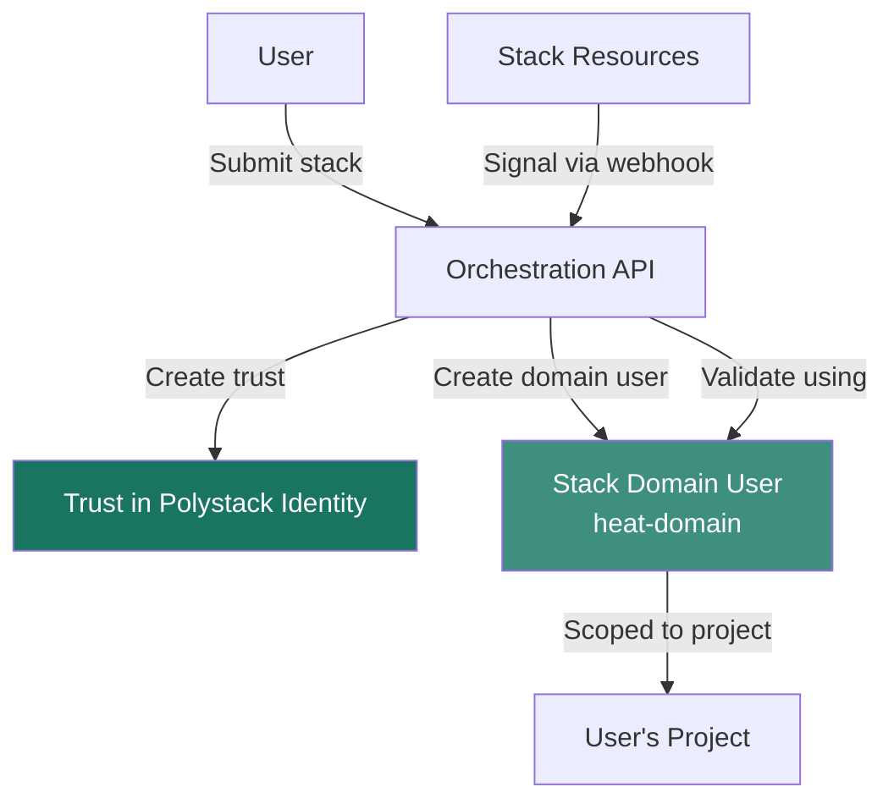

import AdminWarning from '/snippets/admin-warning.mdx';

## Overview

Polystack Orchestration introduces unique security considerations beyond standard service
policies. Templates can create users, assign roles, and invoke webhooks on behalf of
the submitting user — making trust delegation and template validation critical security
controls. This page covers the stack domain model, trust-based authorization,
policy configuration, and template injection prevention.

<AdminWarning />

---

## Stack Domain Users

### Why a Separate Domain Is Needed

When a stack contains resources that require long-running credentials — such as
`WaitCondition` signal URLs, auto-scaling webhooks, or software deployment agents —
the Orchestration engine cannot use the submitting user's token (which expires).
Instead, it creates a short-lived stack domain user scoped to the stack's project.



### Domain User Lifecycle

| Event | Action |
|-------|--------|
| Stack created | Stack domain user created in the `heat` domain, scoped to the stack project |
| Stack deleted | Stack domain user is deleted automatically |
| User token expires | Domain user credentials are refreshed automatically — the stack continues to function |

---

## Trust-Based Authorization

Polystack Orchestration uses Polystack Identity <Tooltip tip="A trust allows one user (trustor) to delegate a subset of their roles to another entity (trustee) for a specific project.">trusts</Tooltip>
to delegate the submitting user's permissions to the engine for resource provisioning.

### How Trusts Work

1. When a stack is submitted, the engine requests a trust from Polystack Identity.
2. The trust grants the engine the submitting user's roles within the stack's project.
3. The engine uses the trust to authenticate when calling compute, networking, and
   storage APIs on behalf of the stack.
4. The trust is tied to the stack — deleting the stack revokes the trust.

### Reviewing Active Trusts

```bash title="List trusts for the current user"
openstack trust list
```

```bash title="Show trust detail"
openstack trust show <TRUST_ID>
```

<Warning>
  Users who are removed from a project while their stacks are still running will have
  their trusts invalidated. The Orchestration engine will fail to provision new resources
  for those stacks until the user is re-added or the stacks are re-created by a valid
  project member.
</Warning>

---

## Policy Configuration

Orchestration API access is governed by policies defined in `policy.yaml`. The default
policy restricts stack management to project members and administration to users with
the `admin` role.

### Default Policy Summary

| Operation | Default Policy |
|-----------|---------------|
| Create stack | `rule:project_member` — any project member |
| Update stack | `rule:project_member` — stack owner or admin |
| Delete stack | `rule:project_member` — stack owner or admin |
| List stacks (all projects) | `rule:admin_required` — admin only |
| Show stack in other project | `rule:admin_required` — admin only |
| Abandon stack | `rule:admin_required` — admin only |
| Validate template | `rule:deny_stack_user` — not stack domain users |

### Overriding Policies

```yaml title="policy.yaml override example"
# Allow project readers to list stacks (not just members)
stacks:list:
  rules:
    - project_reader

# Prevent non-admin users from creating nested stacks
stacks:create_with_nested:
  rules:
    - admin_required
```

Policies are applied via XDeploy configuration overrides in
`/etc/ironcore/orchestration/policy.yaml`.

---

## Template Injection Prevention

<Danger>
  Orchestration templates are powerful — a malicious or misconfigured template can
  create users, assign roles, consume large quota, and trigger webhooks to external
  systems. Never execute untrusted templates from unknown sources.
</Danger>

### Security Controls for Template Execution

| Control | Description |
|---------|-------------|
| **Policy enforcement** | Templates execute with the submitting user's roles. A project member cannot create resources outside their quota or project. |
| **Quota limits** | `heat_max_stacks_per_tenant` and `heat_max_resources_per_stack` prevent runaway resource creation. |
| **Template validation** | Run `openstack orchestration template validate` before deploying untrusted templates to inspect all declared resources. |
| **Allowed resource types** | Configure `allowed_resources` in the engine configuration to restrict which resource types can be used. |
| **Restricted properties** | `restricted_metadata_keys` prevents templates from setting arbitrary instance metadata. |

### Review Template Before Execution

```bash title="Validate and inspect a template"
openstack orchestration template validate \
  --show-nested \
  -t untrusted-template.yaml
```

The output lists every resource type the template will attempt to create. Verify that
all resource types are expected before deploying.

<Tip>
  For multi-tenant environments, configure `allowed_resources` in XDeploy to restrict
  the resource types available to non-admin users. This prevents project members from
  creating identity resources (users, roles) through templates.
</Tip>

---

## Next Steps

<CardGroup cols={2}>
  <Card title="Configuration" href="/services/orchestration/configuration" color="#197560">
    Configure the stack domain, quotas, and service settings
  </Card>
  <Card title="Architecture" href="/services/orchestration/architecture" color="#197560">
    Understand the trust delegation and engine processing flow
  </Card>
  <Card title="Admin Troubleshooting" href="/services/orchestration/admin-troubleshooting" color="#197560">
    Resolve stack domain and authorization failures
  </Card>
  <Card title="Polystack Identity" href="/services/identity/index" color="#197560">
    Manage domains, trusts, and role assignments in Polystack Identity
  </Card>
</CardGroup>
