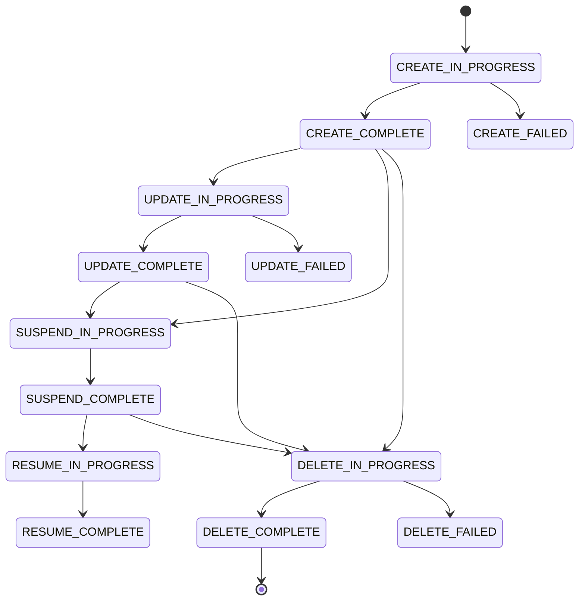

## Overview

Xloud Orchestration manages the complete lifecycle of infrastructure stacks. After initial
creation, a stack can be updated with a revised template or new parameter values, suspended
to release compute and network resources, resumed when needed, and eventually deleted to
clean up all associated resources in a single operation.

<Note>
  **Prerequisites**
  - A deployed stack (see [Create Your First Stack](/services/orchestration/getting-started))
  - `member` or `admin` role in your project
</Note>

---

## Stack Lifecycle



---

## Update a Stack

Stack updates apply changes to an existing stack using a revised template or updated
parameter values. The engine computes a diff between the current and desired state,
then creates, updates, or deletes resources as needed.

<Warning>
  Stack updates can cause resource replacement. Resources that do not support in-place
  updates are deleted and recreated, which may cause downtime. Review the planned
  changes using `--dry-run` before applying to production stacks.
</Warning>

<Tabs>
  <Tab title="Dashboard" icon="gauge">
    <Steps titleSize="h3">
      <Step title="Open the stack" icon="layers">
        Navigate to **Orchestration > Stacks** and click the stack name to
        open its detail view.
      </Step>
      <Step title="Update the template">
        Click the **More** dropdown on the stack row and select **Update Template**.
        The same 2-step wizard opens, pre-populated with the current template and
        parameter values. The stack name is read-only.
      </Step>
      <Step title="Apply changes">
        Modify the template or parameter values, then click **Confirm**.

        <Check>
          Stack status transitions to **Update In Progress**, then **Update Complete**
          when all changes are applied.
        </Check>
      </Step>
    </Steps>
  </Tab>
  <Tab title="CLI" icon="terminal">
    ```bash title="Update stack with revised template"
    openstack stack update \
      --template updated-template.yaml \
      --parameter flavor=m1.large \
      --wait \
      my-stack
    ```

    ```bash title="Preview update changes (dry run)"
    openstack stack update \
      --template updated-template.yaml \
      --dry-run \
      my-stack
    ```

    ```bash title="Update only a parameter value (no template change)"
    openstack stack update \
      --existing \
      --parameter flavor=m1.large \
      --wait \
      my-stack
    ```

    | Flag | Description |
    |------|-------------|
    | `--existing` | Reuse the current template; only update specified parameters |
    | `--dry-run` | Preview planned resource changes without executing them |
    | `--rollback` | Automatically roll back if the update fails |
    | `--wait` | Block until the update reaches a terminal state |
  </Tab>
</Tabs>

---

## Suspend and Resume a Stack

Suspending a stack stops all running instances and releases compute resources while
preserving the stack definition for later resumption.

<Note>
  Suspend and Resume are **CLI-only** operations. They are not available in the
  Dashboard.
</Note>

<CodeGroup>
```bash title="Suspend a stack"
openstack stack suspend --wait my-stack
```
```bash title="Resume a suspended stack"
openstack stack resume --wait my-stack
```
</CodeGroup>

---

## Stack Outputs

Outputs expose values produced by the stack — IP addresses, resource IDs, URLs, and
other runtime data.

<Tabs>
  <Tab title="Dashboard" icon="gauge">
    Open the stack detail page and select the **Detail** tab (Outputs card). All defined outputs
    and their current values are listed.
  </Tab>
  <Tab title="CLI" icon="terminal">
    ```bash title="List all outputs"
    openstack stack output list my-stack
    ```

    ```bash title="Show a specific output"
    openstack stack output show my-stack instance_ip
    ```

    ```bash title="Show output in JSON"
    openstack stack output show my-stack instance_ip -f json
    ```
  </Tab>
</Tabs>

---

## Nested Stacks

A nested stack is a stack created as a resource within a parent stack using the
`Xloud::Orchestration::Stack` resource type. Nesting enables modular template design
— common patterns such as networking tiers, database clusters, or load balancer
configurations can be extracted into reusable child templates.

```yaml title="parent-stack-with-nested.yaml"
resources:

  network_tier:
    type: Xloud::Orchestration::Stack
    properties:
      template: { get_file: network-template.yaml }
      parameters:
        cidr: "10.0.0.0/24"
        external_network: { get_param: external_network }

  app_tier:
    type: Xloud::Orchestration::Stack
    depends_on: [network_tier]
    properties:
      template: { get_file: app-template.yaml }
      parameters:
        network: { get_attr: [network_tier, outputs, network_id] }
        flavor: { get_param: app_flavor }
```

<Note>
  Nested stacks appear as child stacks in the Dashboard under the parent stack's
  **Stack Resources** tab. Each child stack has its own resource list, events, and outputs.
</Note>

---

## Delete a Stack

<Danger>
  Deleting a stack permanently destroys all resources it manages — including instances,
  volumes marked for deletion, networks, and floating IPs. Resources with
  `deletion_policy: Retain` in the template are preserved.
</Danger>

<Tabs>
  <Tab title="Dashboard" icon="gauge">
    In the Stacks list, click **Delete** (the first row action) on the stack row.
    Confirm the operation in the dialog. You can also select multiple stacks using
    checkboxes and click **Delete** in the batch actions bar.

    The **More** dropdown also offers **Abandon Stack** — this removes the stack
    record but preserves the deployed resources (unlike Delete which removes
    everything).

    <Check>Stack transitions to **Delete In Progress** and then disappears from the list.</Check>
  </Tab>
  <Tab title="CLI" icon="terminal">
    ```bash title="Delete a stack"
    openstack stack delete --yes --wait my-stack
    ```

    ```bash title="Delete multiple stacks"
    openstack stack delete --yes stack-1 stack-2 stack-3
    ```

    <Check>`openstack stack list` no longer shows the deleted stacks.</Check>
  </Tab>
</Tabs>

---

## Next Steps

<CardGroup cols={2}>
  <Card title="Auto-Scaling" href="/services/orchestration/autoscaling" color="#197560">
    Create auto-scaling groups and alarm-driven scaling policies
  </Card>
  <Card title="Template Guide" href="/services/orchestration/template-guide" color="#197560">
    Author templates with parameters, conditions, and intrinsic functions
  </Card>
  <Card title="Resource Types" href="/services/orchestration/resources" color="#197560">
    Full reference for all supported resource types and their properties
  </Card>
  <Card title="Troubleshooting" href="/services/orchestration/troubleshooting" color="#197560">
    Resolve stack update failures, rollback issues, and dependency errors
  </Card>
</CardGroup>
