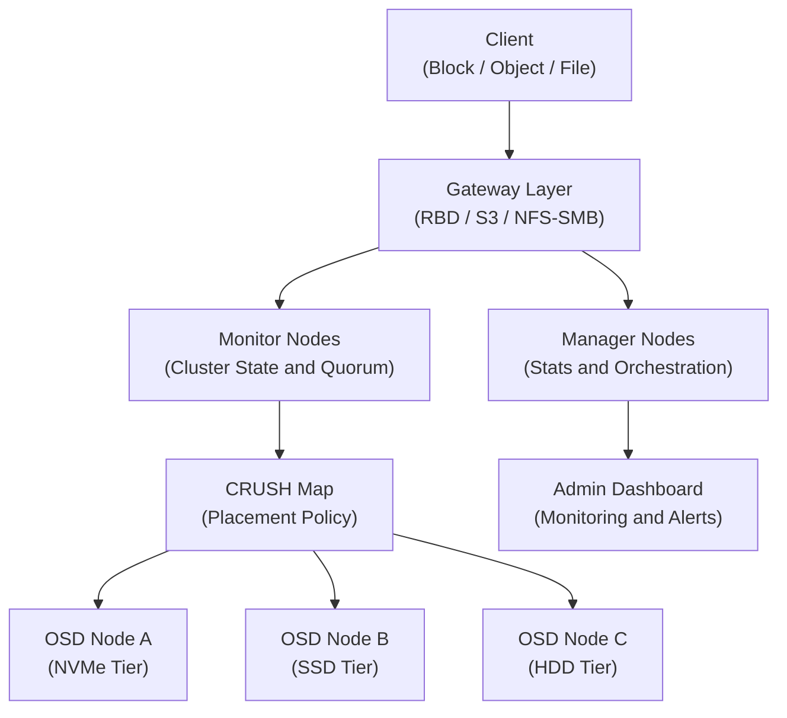

## Overview

The Software-Defined-Storage distributed storage cluster is composed of several service types that work
together to provide unified block, object, and file storage. Services are deployed
and managed by XDeploy.

<Tip>
  **XDeploy GUI** — The distributed storage cluster can be bootstrapped and managed through the [Software-Defined-Storage Storage](/deployment/software-defined-storage) interface. Storage tiers, CRUSH rules, and Ceph configuration are all accessible from the GUI. No manual file editing required.
</Tip>

<Note>
  **Prerequisites**
  - Administrator credentials with the `admin` role
  - Familiarity with distributed storage concepts — replication, erasure coding, and data placement
</Note>

---

## Architecture Diagram



---

## Service Components

| Service | Role | Minimum Count |
|---------|------|--------------|
| **Monitor (MON)** | Maintains authoritative cluster state and quorum. Must have an odd number for majority voting. | 3 |
| **Manager (MGR)** | Provides metrics, orchestration API, and dashboard. Active-standby. | 2 |
| **OSD** | Object Storage Daemon — one per physical storage device. Handles I/O, replication, and recovery. | 3 per replica factor |
| **MDS** | Metadata Server — required for shared file storage. Active-standby. | 2 |
| **RGW** | RADOS Gateway — provides the S3-compatible object storage API. | 2 (HA pair) |

---

## Component Deep Dive

<AccordionGroup>
  <Accordion title="Monitor (MON)" icon="eye">
    Monitors maintain the authoritative cluster state map, which includes:
    - **OSD map**: Which OSDs are up, down, in, or out
    - **CRUSH map**: Placement topology and rules
    - **PG map**: State of all placement groups
    - **MDS map**: Metadata server state (if using shared file storage)

    Monitors use Paxos consensus to agree on cluster state. A majority (quorum) of
    monitors must be reachable for the cluster to accept writes. With 3 monitors,
    the cluster survives 1 monitor failure. With 5 monitors, it survives 2.

    <Warning>
      Never run fewer than 3 monitors in production. A 2-monitor cluster loses quorum
      if either monitor fails, halting all write operations.
    </Warning>
  </Accordion>

  <Accordion title="Object Storage Daemon (OSD)" icon="hard-drive">
    Each OSD manages one physical storage device. OSDs are responsible for:
    - Serving client read/write requests
    - Replicating data to peer OSDs according to the CRUSH map
    - Running scrub operations to detect and repair data corruption
    - Reporting health status to monitors

    OSD state has two dimensions:
    - **up/down**: Whether the OSD process is running
    - **in/out**: Whether the OSD is participating in data distribution

    An OSD that is `down` but `in` triggers recovery. An OSD that is `out` has its
    data redistributed to remaining OSDs.
  </Accordion>

  <Accordion title="RADOS Gateway (RGW)" icon="globe">
    RGW provides the S3-compatible object storage API. It translates S3 API requests
    into RADOS operations against the underlying storage cluster.

    RGW is stateless — all state is stored in the cluster. Deploy at least 2 RGW
    instances behind a load balancer for high availability. XDeploy configures the
    HAProxy frontend automatically.

    RGW supports:
    - S3-compatible API (buckets, objects, ACLs, lifecycle policies)
    - Multi-site replication between Software-Defined-Storage clusters
    - Pre-signed URLs for time-limited object access
  </Accordion>

  <Accordion title="Metadata Server (MDS)" icon="folder-open">
    MDS manages the metadata for the distributed file system. Each client inode,
    directory, and file name is tracked by an active MDS instance.

    MDS instances are either active (serving metadata requests) or standby (ready
    to take over). On active MDS failure, a standby takes over within seconds.

    Multiple active MDS instances (multi-active MDS) can be configured for large
    deployments with high metadata operation rates. Contact your Polystack support team
    for multi-active MDS configuration guidance.
  </Accordion>
</AccordionGroup>

---

## Deployment Architecture

<Tabs>
  <Tab title="Single-Site" icon="server">
    A standard single-site Software-Defined-Storage cluster distributes OSDs across at least 3 hosts,
    with monitor and manager services co-located on the same hosts:

    ```mermaid
    graph LR
        subgraph Node1["Storage Node 1"]
            MON1["MON"]
            MGR1["MGR"]
            OSD1a["OSD.0 (NVMe)"]
            OSD1b["OSD.1 (SSD)"]
        end
        subgraph Node2["Storage Node 2"]
            MON2["MON"]
            OSD2a["OSD.2 (NVMe)"]
            OSD2b["OSD.3 (SSD)"]
        end
        subgraph Node3["Storage Node 3"]
            MON3["MON"]
            MGR2["MGR (standby)"]
            OSD3a["OSD.4 (NVMe)"]
            OSD3b["OSD.5 (SSD)"]
        end
    ```
  </Tab>
  <Tab title="Multi-Site" icon="globe">
    For disaster recovery configurations, Software-Defined-Storage supports multi-site replication
    between two independent clusters. Each site runs its own full cluster with
    its own monitors, managers, and OSDs.

    Replication between sites is handled at the RGW layer (for object storage)
    or at the block device level via Disaster Recovery (for block storage).

    See the [Disaster Recovery Admin Guide](/services/disaster-recovery/admin-guide) for
    cross-site replication configuration.
  </Tab>
</Tabs>

---

## Next Steps

<CardGroup cols={2}>
  <Card title="Cluster Management" href="/services/sds/admin-guide/cluster-management" color="#bf9667">
    Monitor cluster health, manage services, and perform operational procedures
  </Card>
  <Card title="Pool Management" href="/services/sds/admin-guide/pool-management" color="#bf9667">
    Create and configure storage pools with the appropriate protection scheme
  </Card>
  <Card title="CRUSH Maps" href="/services/sds/admin-guide/crush-maps" color="#bf9667">
    Define failure domains and device class rules for data placement
  </Card>
  <Card title="Capacity Planning" href="/services/sds/admin-guide/capacity-planning" color="#bf9667">
    Monitor utilization and plan cluster expansion before capacity is exhausted
  </Card>
</CardGroup>
