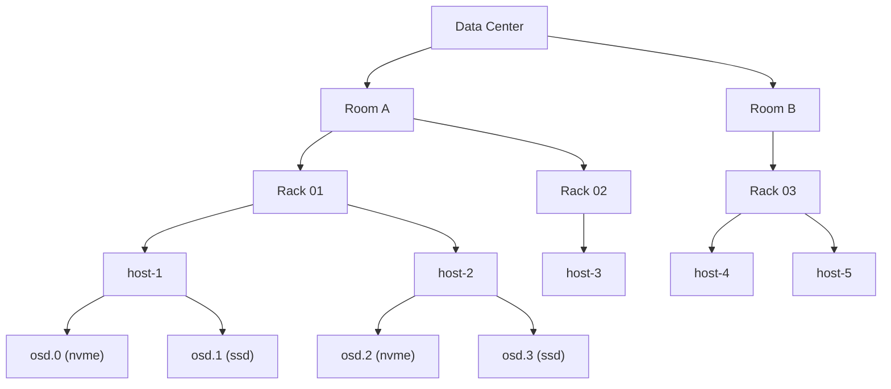

import AdminWarning from '/snippets/admin-warning.mdx';

## Overview

The CRUSH map defines the hierarchical topology of the storage cluster — how nodes,
racks, and rooms are structured, and how data is distributed across failure domains.
Correct CRUSH configuration ensures data is spread across independent failure domains
for maximum availability.

<AdminWarning />

<Note>
  **Prerequisites**
  - Administrator credentials with the `admin` role
  - SSH access to a cluster management node
  - Understanding of your physical infrastructure topology (host, rack, room layout)
</Note>

---

## CRUSH Hierarchy

The CRUSH hierarchy places storage devices into a tree of buckets. Data placement
rules traverse this tree to select OSDs from distinct failure domains.



---

## Viewing the CRUSH Map

<Tabs>
  <Tab title="OSD Tree" icon="list">
    ```bash title="View OSD tree with device classes"
    ceph osd tree
    ```

    This shows the current hierarchy and the device class assigned to each OSD.
  </Tab>
  <Tab title="Full CRUSH Map" icon="map">
    ```bash title="Export and decompile the CRUSH map"
    ceph osd getcrushmap -o /tmp/crushmap.bin
    crushtool -d /tmp/crushmap.bin -o /tmp/crushmap.txt
    cat /tmp/crushmap.txt
    ```

    The compiled CRUSH map defines:
    - **Device class assignments** — which OSDs belong to NVMe, SSD, or HDD classes
    - **Bucket hierarchy** — OSDs → hosts → racks → data center rooms
    - **Replication rules** — how many copies to place and across which failure domains
  </Tab>
</Tabs>

---

## Device Class Rules

Device class CRUSH rules route data to a specific storage tier. Create one rule
per device class to enable multi-tier storage.

<Steps titleSize="h3">
  <Step title="Create a device class rule" icon="plus">
    ```bash title="Create SSD device class rule"
    ceph osd crush rule create-replicated \
      replicated_rule_ssd default host ssd
    ```

    ```bash title="Create NVMe device class rule"
    ceph osd crush rule create-replicated \
      replicated_rule_nvme default host nvme
    ```

    ```bash title="Create HDD device class rule"
    ceph osd crush rule create-replicated \
      replicated_rule_hdd default host hdd
    ```

    Valid device classes: `nvme`, `ssd`, `hdd`.
  </Step>
  <Step title="Assign rule to a pool" icon="database">
    ```bash title="Assign CRUSH rule to pool"
    ceph osd pool set <POOL_NAME> crush_rule replicated_rule_ssd
    ```

    <Note>
      In a single-device-class cluster (all SSD), changing a pool's CRUSH rule from
      `replicated_rule` to `replicated_rule_ssd` involves zero data movement — data
      is already on the correct devices.
    </Note>
  </Step>
  <Step title="Verify rule assignment" icon="circle-check">
    ```bash title="List rules and their pools"
    ceph osd crush rule dump --format json | python3 -m json.tool
    ```

    ```bash title="Show pool CRUSH rule"
    ceph osd pool get <POOL_NAME> crush_rule
    ```

    <Check>Pool reports the new CRUSH rule name and OSD tree shows data on the correct device class.</Check>
  </Step>
</Steps>

---

## Managing OSD Device Classes

OSDs are automatically classified by device type at deployment. Verify or override
classifications as needed.

<Tabs>
  <Tab title="View Classifications" icon="list">
    ```bash title="List all OSD device classes"
    ceph osd crush class ls
    ```

    ```bash title="List OSDs in a specific class"
    ceph osd crush class ls-osd ssd
    ```
  </Tab>
  <Tab title="Reclassify an OSD" icon="settings">
    ```bash title="Remove current classification"
    ceph osd crush rm-device-class <OSD_ID>
    ```

    ```bash title="Set new device class"
    ceph osd crush set-device-class ssd <OSD_ID>
    ```

    <Warning>
      In a multi-class cluster with existing data, reclassifying an OSD to a different
      class can trigger data migration if pools have class-specific CRUSH rules. Verify
      cluster health is `HEALTH_OK` before reclassifying.
    </Warning>
  </Tab>
</Tabs>

---

## Failure Domain Configuration

Configure CRUSH rules to spread replicas across independent failure domains. The
failure domain level determines how many simultaneous failures the cluster can
survive without data loss.

| Failure Domain | Survives | Recommended For |
|---------------|---------|----------------|
| `host` | Any number of OSD failures on different hosts | Small clusters (< 10 hosts) |
| `rack` | Entire rack failures (power, networking) | Medium clusters with physical racks |
| `room` | Room-level failures (fire, flood) | Large data center deployments |

```bash title="Create a rack-level failure domain rule"
ceph osd crush rule create-replicated \
  replicated_rule_ssd_rack default rack ssd
```

<Tip>
  For most production deployments, `host`-level failure domains provide the right
  balance of protection and OSD count requirements. Use `rack`-level failure domains
  only when you have at least 3 physical racks in your deployment.
</Tip>

---

## Next Steps

<CardGroup cols={2}>
  <Card title="Pool Management" href="/services/sds/admin-guide/pool-management" color="#197560">
    Create pools and assign the CRUSH rules you've just configured
  </Card>
  <Card title="Storage Tiers" href="/services/sds/admin-guide/storage-tiers" color="#197560">
    Wire device class rules to Cinder volume types for multi-tier storage
  </Card>
  <Card title="Cluster Management" href="/services/sds/admin-guide/cluster-management" color="#197560">
    Monitor cluster health and manage OSDs in your configured topology
  </Card>
  <Card title="Troubleshooting" href="/services/sds/admin-guide/troubleshooting" color="#197560">
    Diagnose CRUSH-related issues including imbalanced data distribution
  </Card>
</CardGroup>
