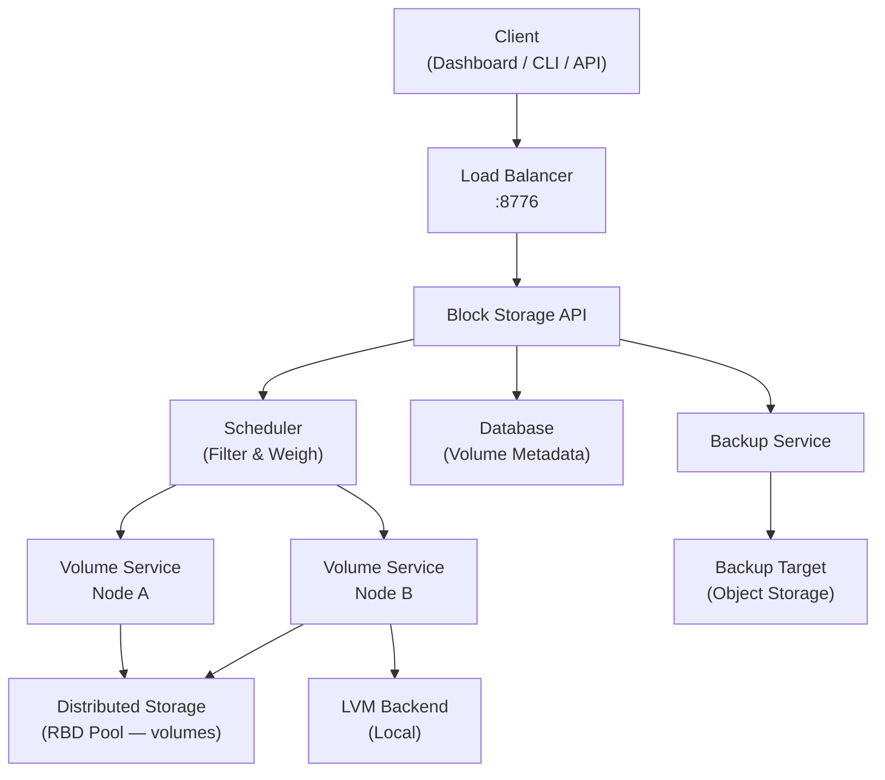
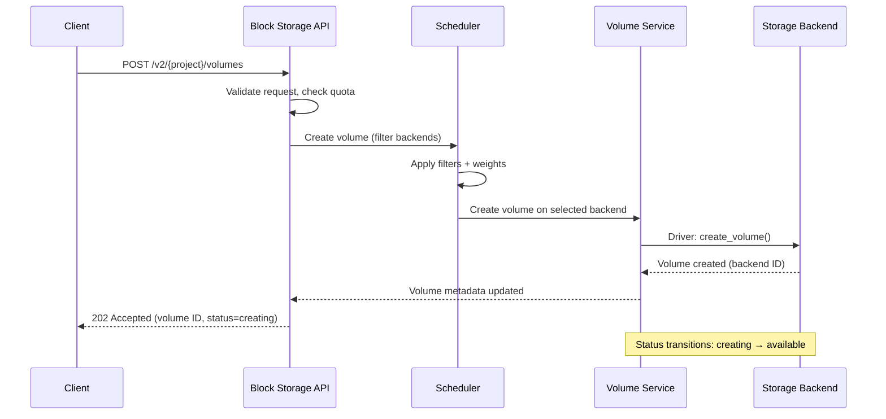
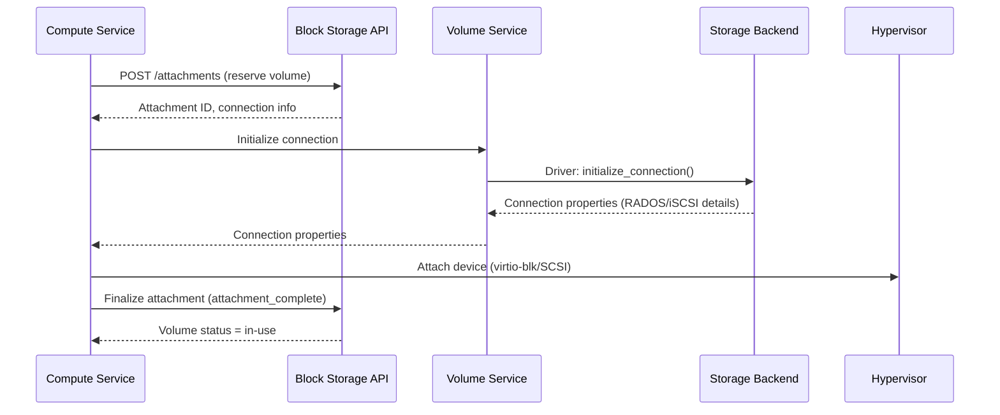

import AdminWarning from '/snippets/admin-warning.mdx';

## Overview

Polystack Block Storage delivers persistent block volumes to compute instances through a distributed service architecture. The service separates its API layer, scheduling logic, and backend drivers — enabling flexible backend configurations, horizontal scaling, and multi-backend deployments where different hardware tiers serve distinct workload categories.

<AdminWarning />

---

## Architecture Diagram

---

## Principal Components

| Component | Default Port | Role |
|-----------|-------------|------|
| **Block Storage API** | 8776 | RESTful endpoint for all volume operations; sits behind the load balancer on the VIP |
| **Scheduler** | — | Selects the appropriate backend for each volume create/migrate request using filter and weight algorithms |
| **Volume Service** | — | Runs on each storage node; communicates with the backend driver to create, attach, snapshot, and delete volumes |
| **Backup Service** | — | Manages backup creation, restoration, and deletion to the configured backup target |
| **Database** | 3306 | Stores volume, snapshot, backup, and attachment metadata (MariaDB/Galera cluster) |

---

## Request Flow

### Volume Create

### Volume Attach

---

## Backend Driver Model

The backend driver is the component that communicates with the physical or virtual storage system. Polystack Block Storage supports multiple drivers that can be active simultaneously:

| Backend Driver | Type | HA | Production Ready |
|---------------|------|----|-----------------|
| **RBD (Distributed Storage)** | Distributed | Yes | Yes — recommended for production |
| **LVM** | Local block | No | Development / single-node only |
| **NFS** | Network filesystem | Depends on NFS server | Legacy integration |

<Tip>
  Production deployments should use the distributed storage (RBD) driver. LVM is
  acceptable for single-node development environments and should not be used where
  data durability is required.
</Tip>

---

## Multi-Backend Deployment

Polystack Block Storage supports multiple concurrent backends. The scheduler filters backends
using configurable filters and selects the optimal backend using a weighting algorithm:

| Filter | Purpose |
|--------|---------|
| `AvailabilityZoneFilter` | Only selects backends in the requested availability zone |
| `CapacityFilter` | Eliminates backends without sufficient free capacity |
| `CapabilitiesFilter` | Matches backend capabilities to volume type extra specs |
| `DriverFilter` | Custom filter expressions in backend configuration |

The `CapacityWeigher` (default) prioritizes backends with more free capacity to spread
load across the cluster.

---

## High Availability

In a high-availability deployment:

- The **Block Storage API** runs on all control plane nodes, load-balanced via the VIP
- The **Scheduler** runs on all control plane nodes (active-active)
- The **Volume Service** runs on each storage node (active-active per backend)
- The **Database** uses Galera multi-master replication across control plane nodes
- The **Backup Service** runs on one or more dedicated nodes

<Note>
  XDeploy automatically configures high-availability service placement based on your
  cluster topology. Manual service placement is not required for standard deployments.
</Note>

---

## Next Steps

<CardGroup cols={2}>
  <Card title="Storage Backends" href="/services/storage/storage-backends" color="#bf9667">
    Configure distributed storage, LVM, and NFS backend drivers
  </Card>
  <Card title="Volume Types & QoS" href="/services/storage/volume-types-admin" color="#bf9667">
    Create volume types and enforce I/O quality-of-service limits
  </Card>
  <Card title="Storage Tiers" href="/services/storage/storage-tiers" color="#bf9667">
    Configure NVMe, SSD, and HDD tier mappings for multi-tier deployments
  </Card>
  <Card title="Admin Guide" href="/services/storage/admin-guide" color="#bf9667">
    Return to the Block Storage administration overview
  </Card>
</CardGroup>
