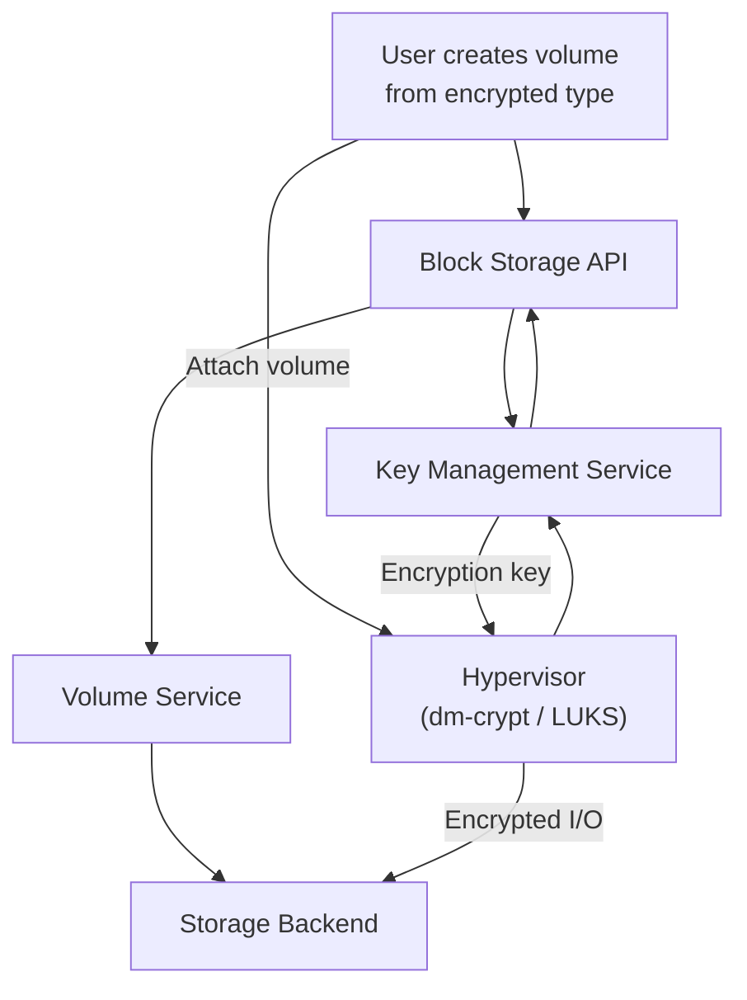

import AdminWarning from '/snippets/admin-warning.mdx';
import CliAuth from '/snippets/cli-auth.mdx';

## Overview

Volume encryption provides transparent at-rest protection for block storage data. Encryption is configured per volume type — all volumes created from an encrypted type are automatically encrypted without any additional action from you. Encryption keys are managed by the Polystack Key Management service and retrieved at volume attach time by the volume service, ensuring keys are never stored on the compute node's disk.

<AdminWarning />

<Tabs>
  <Tab title="XDeploy" icon="server">
    Disk encryption is enabled through the XDeploy Configuration panel:

    <Steps titleSize="h3">
      <Step title="Enable KMS first" icon="key">
        Navigate to **XDeploy → Configuration → Advance Features** and ensure
        **Enable KMS** is set to **Yes**. Disk encryption requires the Polystack Key
        Management service to store and manage encryption keys.
      </Step>
      <Step title="Enable Disk Encryption" icon="lock">
        On the same **Advance Features** tab, set **Enable Disk Encryption** to **Yes**.
      </Step>
      <Step title="Save and deploy" icon="rocket">
        Click **Save Configuration**, then navigate to **XDeploy → Operations** and
        run a **Deploy** or **Reconfigure** for the Block Storage and Key Management
        services.

        <Check>Disk encryption is enabled. Create encrypted volume types to apply encryption to new volumes.</Check>
      </Step>
    </Steps>

    <Warning>
      KMS must be fully deployed and accessible from all compute nodes before enabling
      disk encryption. If KMS is unreachable, encrypted volume attach operations will fail.
    </Warning>
  </Tab>
  <Tab title="CLI" icon="terminal">
    Configure encryption by creating encrypted volume types via the CLI. The Key Management
    service must be deployed and accessible before proceeding. See the configuration steps below.
  </Tab>
</Tabs>

<Note>
  **Prerequisites**
  - Administrator credentials with the `admin` role
  - Polystack Key Management service deployed and accessible
  - At least one unencrypted volume type to apply encryption to (or create a new type)
  - All compute nodes must be able to reach the Key Management service API
</Note>

---

## Encryption Architecture



| Component | Role |
|-----------|------|
| **Block Storage API** | Creates volume with encryption metadata; requests key from KMS |
| **Key Management Service** | Generates and stores the encryption key; returns it at attach time |
| **Volume Service** | Provisions the volume on the backend with encryption metadata |
| **Hypervisor (dm-crypt)** | Applies LUKS encryption/decryption at the block device layer |

---

## Configure Volume Type Encryption

<Warning>
  Encryption settings cannot be added to or removed from a volume type that already has
  volumes. Create a new encrypted volume type and migrate existing volumes if encryption
  is required on previously unencrypted data.
</Warning>

<Tabs>
  <Tab title="Dashboard" icon="gauge">
    <Steps titleSize="h3">
      <Step title="Select the volume type to encrypt" icon="lock">
        Navigate to
        **Storage > Volume Types** (admin view). Click the volume type name to open its
        details page.
      </Step>
      <Step title="Create encryption settings" icon="key">
        Click **Create Encryption**. Configure the parameters:

        | Field | Recommended Value | Description |
        |-------|-------------------|-------------|
        | Provider | `LuksEncryptor` | LUKS-based encryption via dm-crypt |
        | Cipher | `aes-xts-plain64` | AES-XTS — FIPS-compatible, hardware-accelerated |
        | Key Size | `256` | Key length in bits (256 for AES-256) |
        | Control Location | `front-end` | Encryption applied at the hypervisor layer |

        Click **Confirm**.

        <Tip>
          `aes-xts-plain64` with a 256-bit key provides AES-256 encryption. This cipher
          is hardware-accelerated on all modern CPUs (AES-NI) and meets FIPS 140-2
          requirements when combined with a FIPS-validated key management service.
        </Tip>
      </Step>
      <Step title="Verify encryption is active" icon="circle-check">
        The volume type details page now shows an encryption configuration block.
        All new volumes created from this type will be encrypted automatically.

        <Check>Volume type encryption configured — all new volumes of this type are encrypted at rest.</Check>
      </Step>
    </Steps>
  </Tab>
  <Tab title="CLI" icon="terminal">
    <Steps titleSize="h3">
      <Step title="Authenticate" icon="key">
        <CliAuth />
      </Step>
      <Step title="Create an encrypted volume type" icon="plus">
        Create a new type specifically for encrypted volumes:
        ```bash title="Create encrypted volume type"
        openstack volume type create \
          --description "SSD — AES-256 encrypted at rest" \
          ssd-encrypted
        ```

        Associate with the correct backend:
        ```bash title="Set backend association"
        openstack volume type set \
          --property volume_backend_name=ssd-backend \
          ssd-encrypted
        ```
      </Step>
      <Step title="Enable encryption on the type" icon="lock">
        ```bash title="Configure LUKS encryption"
        openstack volume type set \
          --encryption-provider LuksEncryptor \
          --encryption-cipher aes-xts-plain64 \
          --encryption-key-size 256 \
          --encryption-control-location front-end \
          ssd-encrypted
        ```
      </Step>
      <Step title="Verify encryption configuration" icon="circle-check">
        ```bash title="Show encryption settings"
        openstack volume type show ssd-encrypted -c encryption
        ```

        <Check>Encryption configured on the volume type. New volumes will be encrypted automatically.</Check>
      </Step>
    </Steps>
  </Tab>
</Tabs>

---

## Test Encryption

Verify that encryption is working end-to-end by creating and attaching a test volume:

<Steps titleSize="h3">
  <Step title="Create an encrypted volume" icon="plus">
    ```bash title="Create test encrypted volume"
    openstack volume create \
      --size 10 \
      --type ssd-encrypted \
      test-encrypted-volume
    ```
  </Step>
  <Step title="Attach to an instance" icon="link">
    ```bash title="Attach encrypted volume"
    openstack server add volume <instance-id> test-encrypted-volume
    ```
  </Step>
  <Step title="Verify LUKS inside the instance" icon="lock">
    SSH into the instance and check the block device:
    ```bash title="Check LUKS header"
    sudo cryptsetup isLuks /dev/vdb && echo "LUKS encrypted" || echo "Not encrypted"
    ```

    <Check>Device reports LUKS encryption — volume is encrypted at rest.</Check>
  </Step>
  <Step title="Clean up" icon="trash">
    ```bash title="Detach and delete test volume"
    openstack server remove volume <instance-id> test-encrypted-volume
    openstack volume delete test-encrypted-volume
    ```
  </Step>
</Steps>

---

## Key Management Dependency

<Warning>
  Encryption key loss means the volume data is permanently inaccessible — there is no
  recovery path without the key. Before enabling volume encryption in production, ensure
  the Polystack Key Management service is:
  - Deployed in a high-availability configuration
  - Backed up regularly (key database backup)
  - Accessible from all compute nodes that may attach encrypted volumes
</Warning>

If the Key Management service is unavailable, attaching an encrypted volume will fail
with an authentication or connectivity error.

---

## Per-Volume Selective Encryption

<Info>**Polystack-Developed** -- This capability is developed by Polystack and ships with Ironcore / XPCI.</Info>

Polystack supports **selective encryption** -- encrypted and unencrypted volume types coexist within the same deployment. This allows administrators to apply encryption only where compliance or data sensitivity requires it, avoiding the performance overhead of blanket encryption on non-sensitive workloads.

Key characteristics:

- **Per-tenant key isolation** -- each tenant's encryption keys are stored and managed independently in the Polystack Key Management service. Tenants cannot access each other's keys, even if they share the same storage backend.
- **Three independent encryption layers** -- Polystack provides encryption at three distinct levels that can be enabled independently or together:

| Layer | Scope | Encryption Point |
|-------|-------|-----------------|
| **Storage device encryption** | Full disk on physical storage nodes | Hardware or dm-crypt on the OSD device |
| **Block volume encryption** | Individual persistent volumes | LUKS at the hypervisor (dm-crypt) per volume type |
| **Compute ephemeral disk encryption** | Instance root and ephemeral disks | LUKS at the hypervisor for ephemeral storage |

<Tip>
  For most deployments, block volume encryption alone satisfies data-at-rest compliance
  requirements. Add storage device encryption for defense-in-depth on shared infrastructure,
  and ephemeral disk encryption for instances that process sensitive data without persistent volumes.
</Tip>

---

## Next Steps

<CardGroup cols={2}>
  <Card title="Key Manager User Guide" href="/services/key-manager/user-guide" color="#197560">
    Manage encryption keys and secrets in the Polystack Key Management service
  </Card>
  <Card title="Volume Types & QoS" href="/services/storage/volume-types-admin" color="#197560">
    Create and manage volume types with backend associations
  </Card>
  <Card title="Security Hardening" href="/services/storage/security" color="#197560">
    Additional security policies for Block Storage
  </Card>
  <Card title="Admin Guide" href="/services/storage/admin-guide" color="#197560">
    Return to the Block Storage administration overview
  </Card>
</CardGroup>
