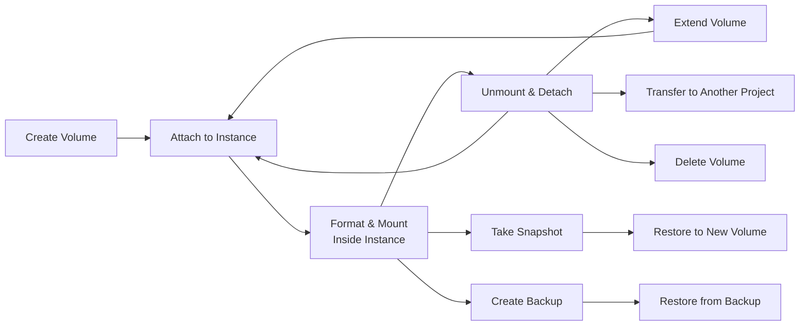

import PrerequisitesAuth from '/snippets/prerequisites-auth.mdx';

Overview

Polystack Block Storage provides persistent, high-performance block devices that attach to your
[Compute instances](/services/compute/user-guide) as virtual disks. Unlike ephemeral instance
storage, block volumes retain data across reboots, migrations, and instance deletion —
making them the standard choice for databases, application state, and any workload where
data durability is required.

<PrerequisitesAuth />

---

Key Concepts

| Term | Description |
|------|-------------|
| **Volume** | A persistent block device that can be attached to one compute instance at a time |
| **Snapshot** | A point-in-time, crash-consistent copy of a volume stored within the same storage cluster |
| **Backup** | A full or incremental copy of a volume written to a separate backup target for long-term retention |
| **Volume Type** | A named storage profile defining the backend, performance tier, IOPS limits, and encryption policy |
| **Attachment** | The binding between a volume and a compute instance, represented as a device path (e.g., `/dev/vdb`) |
| **Transfer** | A token-based mechanism to move volume ownership between projects without copying data |

---

Volume Lifecycle

---

Guides

<CardGroup cols={4}>
  <Card title="Create a Volume" icon="plus" href="/services/storage/create-volume" color="#197560">
    Provision a persistent volume — blank, from an image, or from a snapshot
  </Card>
  <Card title="Attach / Detach Volumes" icon="link" href="/services/storage/attach-volume" color="#197560">
    Connect volumes to instances, format filesystems, mount, and safely detach
  </Card>
  <Card title="Extend a Volume" icon="expand" href="/services/storage/extend-volume" color="#197560">
    Increase volume capacity online without detaching or stopping the instance
  </Card>
  <Card title="Volume Snapshots" icon="camera" href="/services/storage/snapshots" color="#197560">
    Create point-in-time snapshots for fast recovery and volume cloning
  </Card>
  <Card title="Volume Backups" icon="archive" href="/services/storage/backups" color="#197560">
    Full and incremental backups to a separate target for disaster recovery
  </Card>
  <Card title="File-Level Restore" icon="folder-open" href="/services/storage/file-level-restore" color="#197560">
    Browse a snapshot and download individual files or folders — no full-volume restore needed
  </Card>
  <Card title="Third-Party Backup" icon="shield-check" href="/services/storage/third-party-backup" color="#197560">
    Use Trilio, Veeam, Commvault, and other vendors alongside the native backup
  </Card>
  <Card title="Volume Transfers" icon="send" href="/services/storage/volume-transfers" color="#197560">
    Move volume ownership between projects using a token-based transfer
  </Card>
  <Card title="Volume Types" icon="layers" href="/services/storage/volume-types" color="#197560">
    Understand NVMe, SSD, and Standard storage tiers and choose the right one
  </Card>
  <Card title="Troubleshooting" icon="wrench" href="/services/storage/troubleshooting" color="#197560">
    Diagnose and resolve common volume, snapshot, and attachment issues
  </Card>
</CardGroup>

---

Next Steps

<CardGroup cols={4}>
  <Card title="Block Storage Admin Guide" icon="shield" href="/services/storage/admin-guide" color="#197560">
    Configure backends, volume types, QoS policies, and storage tiers
  </Card>
  <Card title="Compute User Guide" icon="server" href="/services/compute/user-guide" color="#197560">
    Launch instances and attach volumes as persistent boot or data disks
  </Card>
  <Card title="CLI Setup" icon="terminal" href="/cli-setup" color="#197560">
    Install and configure the CLI for volume management from the terminal
  </Card>
  <Card title="Authentication" icon="key" href="/cli-setup" color="#197560">
    Configure Dashboard access and CLI credentials
  </Card>
</CardGroup>
