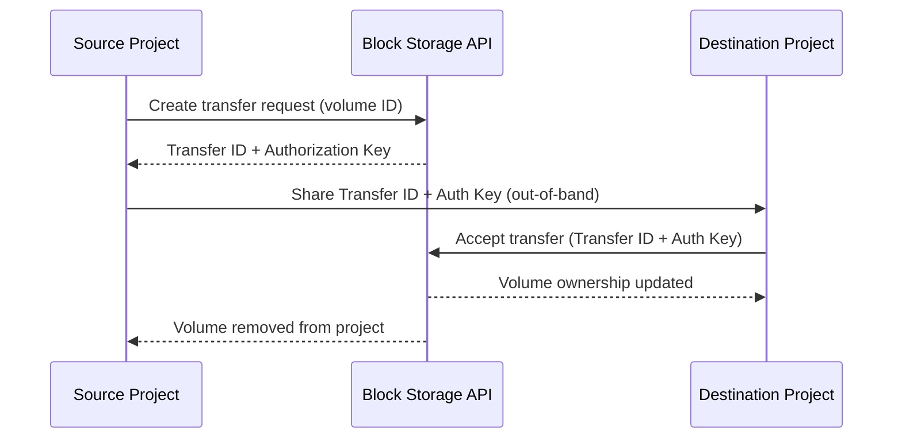

import CliAuth from '/snippets/cli-auth.mdx';

## Overview

Volume transfers move ownership of a volume from one project to another without copying any data. The operation is token-based: the source project creates a transfer request that generates a one-time authorization key, then the destination project accepts the transfer using the ID and key. The volume changes ownership instantly — no data movement occurs.

<Note>
  **Prerequisites**
  - The volume to transfer must have status **Available** (not attached to an instance)
  - The source project user must have the `member` or `admin` role
  - The destination project user must have the `member` or `admin` role
  - Both users must have access to their respective project credentials
</Note>

---

## How Volume Transfers Work



<Warning>
  The authorization key is displayed **only once** at the time of transfer creation.
  Store it securely before closing the dialog or terminal session. If the key is lost,
  cancel the transfer and create a new one.
</Warning>

---

## Transfer a Volume

### Step 1 — Create the Transfer Request (Source Project)

<Tabs>
  <Tab title="Dashboard" icon="gauge">
    <Steps titleSize="h3">
      <Step title="Navigate to Volumes" icon="compass">
        Navigate to
        **Storage > Volumes** as the **source project**.
      </Step>
      <Step title="Create transfer" icon="send">
        Locate the target volume (status must be **Available**). Click
        the **More** dropdown and select **Create Transfer**.

        Provide a descriptive transfer name and click **Confirm**.
      </Step>
      <Step title="Record the credentials" icon="key">
        A dialog displays the **Transfer ID** and **Authorization Key**. Copy both
        values immediately and share them securely with the recipient project
        (e.g., via an encrypted message or password manager).

        <Warning>
          The authorization key is shown only once. It cannot be retrieved after
          closing this dialog. If lost, delete this transfer and create a new one.
        </Warning>
      </Step>
    </Steps>
  </Tab>
  <Tab title="CLI" icon="terminal">
    <Steps titleSize="h3">
      <Step title="Authenticate as source project" icon="key">
        <CliAuth />
      </Step>
      <Step title="Create transfer request" icon="send">
        ```bash title="Create transfer (source project)"
        openstack volume transfer request create \
          --name transfer-to-project-b \
          <volume-name-or-id>
        ```

        The output includes `auth_key` — copy this value immediately. It is shown
        only once.

        ```bash title="List pending transfers"
        openstack volume transfer request list
        ```
      </Step>
    </Steps>
  </Tab>
</Tabs>

### Step 2 — Accept the Transfer (Destination Project)

<Tabs>
  <Tab title="Dashboard" icon="gauge">
    <Steps titleSize="h3">
      <Step title="Switch to destination project" icon="arrows-rotate">
        Log out and log in as a user in the **destination project**, or switch projects
        using the project selector in the Dashboard.
      </Step>
      <Step title="Accept the transfer" icon="inbox">
        Navigate to **Storage > Volumes** and click **Accept Transfer**.

        Enter the **Transfer ID** and **Authorization Key** provided by the source
        project, then click **Confirm**.
      </Step>
      <Step title="Verify" icon="circle-check">
        The volume now appears in the destination project's Volumes list with
        status **Available**.

        <Check>Volume ownership transferred — the volume is now in the destination project.</Check>
      </Step>
    </Steps>
  </Tab>
  <Tab title="CLI" icon="terminal">
    <Steps titleSize="h3">
      <Step title="Authenticate as destination project" icon="key">
        Source credentials for the destination project:
        ```bash title="Load destination project credentials"
        source project-b-openrc.sh
        ```
      </Step>
      <Step title="Accept the transfer" icon="inbox">
        ```bash title="Accept transfer (destination project)"
        openstack volume transfer request accept \
          --auth-key <auth-key> \
          <transfer-id>
        ```

        <Check>Volume ownership transferred. It now appears in the destination project.</Check>
      </Step>
      <Step title="Verify" icon="circle-check">
        ```bash title="Confirm volume is in new project"
        openstack volume list
        ```

        The transferred volume appears in the destination project's volume list.
      </Step>
    </Steps>
  </Tab>
</Tabs>

---

## Cancel a Pending Transfer

If the transfer has not been accepted, the source project can cancel it:

<Tabs>
  <Tab title="Dashboard" icon="gauge">
    Navigate to **Storage > Volumes**. Find the volume with a pending transfer
    indicator and click the **More** dropdown and select **Cancel Transfer**.
  </Tab>
  <Tab title="CLI" icon="terminal">
    ```bash title="List pending transfers"
    openstack volume transfer request list
    ```

    ```bash title="Cancel a transfer"
    openstack volume transfer request delete <transfer-id>
    ```

    <Check>Transfer cancelled. The volume remains in the source project with status **Available**.</Check>
  </Tab>
</Tabs>

---

## Important Limitations

| Constraint | Detail |
|-----------|--------|
| **Volume status** | Must be **Available** — cannot transfer attached volumes |
| **Snapshots** | Snapshots are not transferred — they remain in the source project |
| **Encryption keys** | Encrypted volumes can be transferred, but the destination project must have access to the same key management service |
| **Auth key expiry** | Transfer requests do not expire automatically — cancel unused transfers to maintain security hygiene |

---

## Next Steps

<CardGroup cols={2}>
  <Card title="Create a Volume" href="/services/storage/create-volume" color="#197560">
    Provision a new volume in the destination project after transfer
  </Card>
  <Card title="Volume Snapshots" href="/services/storage/snapshots" color="#197560">
    Create a snapshot before transferring to preserve a copy in the source project
  </Card>
  <Card title="Attach / Detach" href="/services/storage/attach-volume" color="#197560">
    Attach the transferred volume to an instance in the destination project
  </Card>
  <Card title="Volume Types" href="/services/storage/volume-types" color="#197560">
    Understand storage tiers and verify the transferred volume type is available
  </Card>
</CardGroup>
